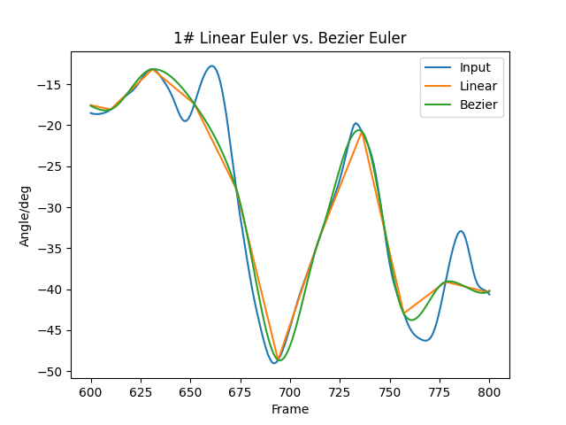
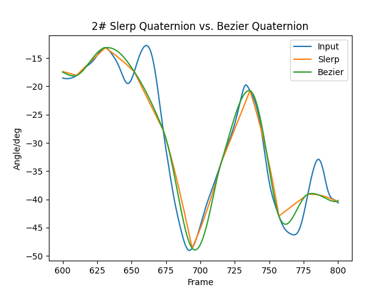
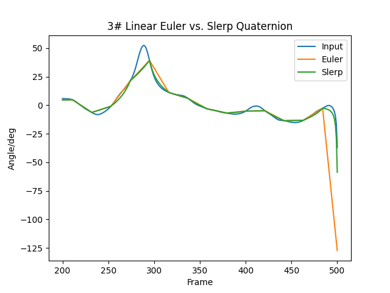
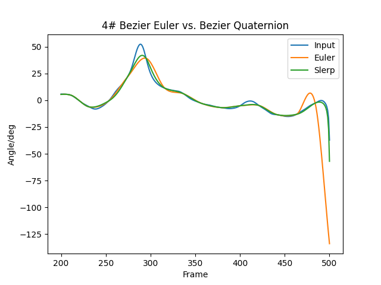

Runan Ye 9954716612

# Report

## Pictures









## Comparison & Findings

1. By comparing the plots in #1 and #2, it is clear that the bezier method generates smoother interpolation than the s/lerp methods.
2. By comparing the plots in #3 and #4, slerping produces smoother curves when the input drops drastically at the frames around 500.

Generally speaking, slerping with quaternion gives results of better quality, given the cost of more computation. Bezier methods generates more natural results that are close to the original inputs, although some places are off.

## Files

```shell
plots.py          # The python scripts that generates the plot pictures.
requirements.txt  # The python packages requirements

test.sh           # The testing shell scripts. Generates all the .amc files that are needed for the assignment.

videos/*          # The video picture sequences. Video numbers are labeled as the name of the folder.   
```